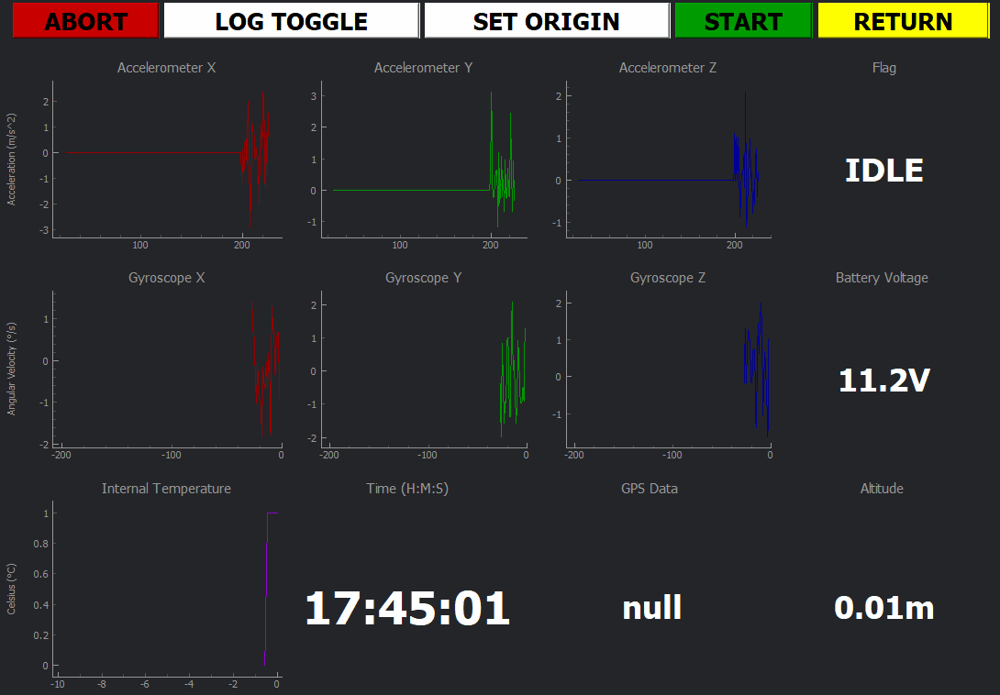

# Ground Station Telemetry GUI

   
  
 

This GUI is designed to be a Ground Station Telemetry Dashboard UI where various sensor data components can be displayed in real time.



## Table of contents
* [General Info](#general-info)
* [Modules](#modules)
* [Setup](#setup)
* [How does it work?](#how-does-it-work)
* [Sources](#sources)


## General info
The purpose of this GUI is to make the data transmitted by an OBC (on board computer) or a TCP connection understandable at first sight.

## Modules
Modules required for this project:

```
numpy == 1.18.2
PyQt5 == 5.14.2
PyQt5-sip == 12.7.2
pyqtgraph == 0.10.0
```


## Setup
To run it you have to open the terminal in the folder and type:
```
$ virtualenv env
$ source env/bin/activate
$ pip install -r requirements.txt
$ python Telemetry_GUI.py
```
if you don't have the electronics you can still use it! It will plot random data for a specified time step `RANDOM_PLOT_STEP=1000` by default. 

## How does it work?
### How does it sample?
Every 10 ms a sample is taken.
The loop is:
```
timer = pg.QtCore.QTimer()
timer.timeout.connect(update)
timer.start(500)
```

### What values uses?
The `update()` function updates the graphics and text of the interface. The first thing it does is get a list of the information to be updated.


### How is the vehicle state changed?
Clicking on the buttons **ABORT**, **START**, **RETURN**, **LOG TOGGLE** and **SET ORIGIN** calls a function that changes the global state variable `CURRENT_STATE`. 

## Sources

*"If I have seen further than others, it is by standing upon the shoulders of giants."*

* Sepúlveda, S. Reyes, P. Weinstein, A. (2015). [Visualizing physiological signals in real-time](https://bit.ly/2XIRzyw). doi: 10.25080/Majora-7b98e3ed-01c
* Golubev, P. (2018). [Run Real-time pyqtgraph in PlotWidget GUI.](https://bit.ly/2VeXSIv)
* Pythonspot.(n.d). [PyQt5.](https://pythonspot.com/pyqt5/)
* [Mr. Tom](https://bit.ly/3amndEZ). (2016). [Calculate speed from accelerometer](https://bit.ly/3acX3nP).
* Selfert, K. Camacho, O. (2007). [Implementing Positioning Algorithms Using Accelerometers](https://bit.ly/2REEH8X). Freescale Semiconductor.
* Many other cool people on stack overflow.
